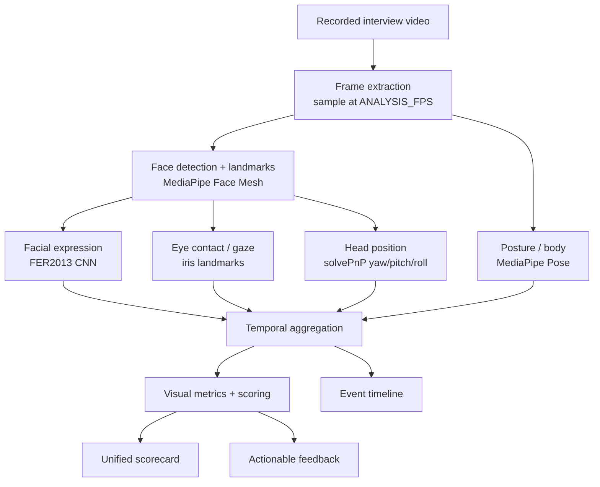
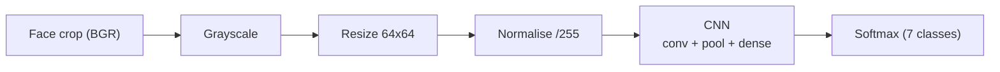
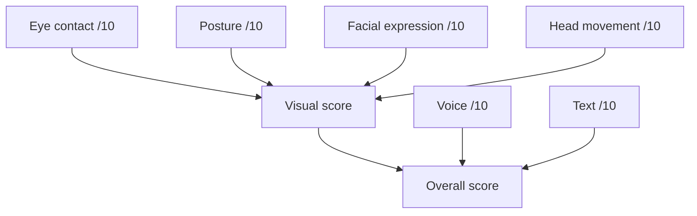

# AceIt — Deep Learning Visual Analysis

**Course deliverable (Intro to Deep Learning).**

This document explains the Deep Learning components of AceIt: what models are
used, how frames flow through the pipeline, and how raw model outputs become
interview-performance metrics. It is written to make clear which parts of the
system belong to the Deep Learning course.

> All visual models are **pretrained** and integrated as-is. We did not train a
> CNN or landmark model from scratch; our contribution is the pipeline,
> mapping layers, temporal aggregation, scoring, and feedback built on top of
> them.

---

## 1. End-to-end pipeline



Module map (`backend/ml/visual/`):

| File | Responsibility |
|------|----------------|
| `frame_processor.py` | decode video (OpenCV, PyAV fallback), sample frames |
| `face_analysis.py` | MediaPipe Face Mesh landmarks + face crop |
| `emotion_analysis.py` | FER2013 CNN inference + mapping layer |
| `eye_contact.py` | iris-based gaze direction / looking-at-camera |
| `gaze.py` | head pose (yaw/pitch/roll) via Perspective-n-Point |
| `posture.py` | MediaPipe Pose upper-body analysis |
| `aggregation.py` | temporal aggregation + event timeline |
| `scoring.py` | metric → /10 with configurable weights |
| `feedback.py` | descriptive, actionable feedback |
| `pipeline.py` | orchestrator with per-frame / per-module error isolation |

---

## 2. Facial Expression Recognition (CNN)

**Model.** The pretrained CNN bundled with the `fer` package
(`emotion_model_quantized.tflite`), a VGG-style convolutional network trained on
the **FER2013** dataset. It is executed with LiteRT (`ai-edge-litert`).

**CNN inference per face**



- **Input:** 64×64×1 grayscale face crop, normalised to `[0, 1]`.
- **Feature extraction:** stacked convolution + pooling layers learn spatial
  features (edges, facial-action regions).
- **Classification:** fully-connected head → softmax over 7 FER2013 classes:
  `angry, disgust, fear, happy, sad, surprise, neutral`.
- **Output:** per-frame class probabilities; we keep the top class and its
  confidence with a timestamp.

**Mapping layer.** The CNN predicts FER2013 emotions, not interview categories.
We therefore apply a documented mapping (`RAW_TO_INTERVIEW`) to four
interview-relevant categories:

| FER2013 class | Interview category |
|---------------|--------------------|
| happy | confident |
| neutral | neutral |
| surprise | confused |
| disgust | confused |
| sad / fear / angry | nervous |

**Temporal aggregation.** Across all face frames we compute the dominant
category, the category distribution, emotional stability (fraction matching the
dominant class), nervous-expression frequency, and engaged-expression frequency.

> We make no psychological or medical claims. Feedback is descriptive, e.g.
> "several frames showed expressions mapped to the configured nervous-expression
> category" — never "you are nervous".

---

## 3. Eye Contact & Gaze (Face Mesh + iris)

**Model.** MediaPipe Face Mesh with `refine_landmarks=True` produces 468 face
landmarks plus 10 iris landmarks (478 total). This is the model specified in the
project proposal (468 keypoints and gaze relative to the webcam plane).

**Gaze estimation.** For each eye we take the iris centre (mean of the 4 iris
landmarks) and express it relative to the eye corners (horizontal axis) and
eyelids (vertical axis):

```
h_ratio = project(iris - eye_left,  eye_right - eye_left)  / |eye_width|^2
v_ratio = project(iris - eye_top,   eye_bottom - eye_top)  / |eye_height|^2
```

A value near `0.5` on both axes means the iris is centred, i.e. the candidate is
looking roughly toward the camera. Offsets beyond `GAZE_H_THRESHOLD` /
`GAZE_V_THRESHOLD` classify the frame as looking left/right/up/down.

Possible per-frame states: `looking_at_camera, looking_left, looking_right,
looking_up, looking_down, face_not_detected`.

**Eye-contact calculation.**
```
eye_contact_percentage = frames_looking_at_camera / valid_face_frames * 100
```
Frames with no reliably-detected face are **excluded** from the denominator, so
they never count as eye-contact failures. The percentage is converted to a
normalised score out of 10.

---

## 4. Head Position (Perspective-n-Point)

Using a stable subset of Face Mesh landmarks (nose tip, chin, eye corners, mouth
corners) and a canonical 3D face model, OpenCV `solvePnP` recovers the head
rotation, converted to **yaw** (left/right), **pitch** (up/down), and **roll**
(tilt) in degrees.

Only *extreme* positions are flagged as events (`looking_down`, `turned_away`,
`head_tilt`), so natural movement is not penalised. Head stability is derived
from the angular variance across frames; frequent downward head movement reduces
the head-movement score.

---

## 5. Posture (MediaPipe Pose / BlazePose)

**Model.** MediaPipe Pose (BlazePose) regresses 33 body landmarks with
visibility scores. We use the upper-body subset: shoulders, ears, nose.

Analysis:
- **Shoulder symmetry** — vertical difference between shoulders, normalised by
  shoulder width.
- **Head/neck forward** — vertical offset of the head above the shoulder line
  (a dropping head indicates slouch).

Per-frame states: `good_posture, slightly_slouched, slouched, unstable,
body_not_detected`.

**Framing-aware.** If the shoulders are not confidently visible the frame is
labelled `body_not_detected` and **excluded** from scoring, so a candidate whose
body is simply out of frame is not penalised.

---

## 6. Scoring

Every metric is scored out of 10 (`scoring.py`). All weights live in
`config.py`.



- `visual_score = Σ(weightᵢ · scoreᵢ) / Σ weightᵢ` over available visual
  sub-scores (`VISUAL_WEIGHTS`, default eye 0.30 / posture 0.25 / expression
  0.25 / head 0.20).
- `overall_score` combines voice / text / visual (`OVERALL_WEIGHTS`, default
  0.30 / 0.35 / 0.35). **Missing modalities are dropped and the remaining
  weights are renormalised**, so an audio-only or text-only session still yields
  a valid overall score.

Per-metric formulas (transparent, documented in code):
- eye-contact score = percentage / 10
- posture score = good-posture-% / 10, nudged by stability
- expression score = engagement-weighted blend of the category distribution
- head-movement score = stability × 10, penalised by looking-down frequency

---

## 7. Robustness & performance

- **Frame sampling** at `ANALYSIS_FPS` (default 5) with a `MAX_FRAMES` cap keeps
  processing bounded.
- **Error isolation** at three levels: decode failures → friendly error;
  per-frame failures → that frame contributes nothing; per-module failures →
  that metric is marked unavailable. One failing component never crashes the
  request.
- The pipeline tolerates corrupted video, very short recordings, missing faces,
  out-of-frame bodies, poor lighting, and per-frame model failures (covered by
  tests in `tests/test_pipeline_edge_cases.py`).

---

## 8. Model information summary

| Model | Role | Pretrained | From scratch | Input | Output |
|-------|------|-----------|--------------|-------|--------|
| FER2013 CNN (LiteRT) | facial expression | ✅ | ❌ | 64×64×1 gray | 7-class softmax |
| MediaPipe Face Mesh | landmarks, gaze, head pose | ✅ | ❌ | RGB frame | 468 + 10 iris landmarks |
| MediaPipe Pose (BlazePose) | posture | ✅ | ❌ | RGB frame | 33 body landmarks |

The baseline audio model (`backend/classifiers/audio_model.py`) is a small
TensorFlow/Keras network **trained within this project** on the Speech Accent
Archive and used as the voice-clarity signal; it is separate from the pretrained
visual models above.

This metadata is also served live at `GET /api/model-info` and shown on the
frontend **Models** page.
